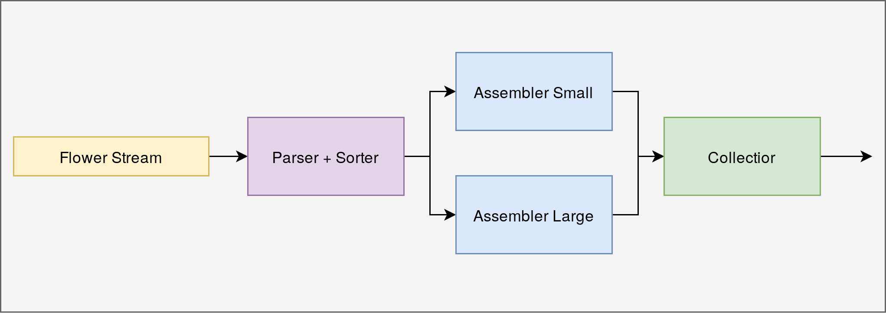

# bouquets
Bloomon technical challenge

## Building & Running

To build the docker image run 

```bash
make build
```

the docker image can then be run by mounting the input file as a
volume and pointing to it

```bash
docker run -v $PWD/file.txt:/file.txt bouquets:latest /file.txt
```

:bangbang: **NOTE** :bangbang: 
Do not use relative paths when mounting the volume as it will not work. 

## Design



The problem outlines two distinct solution categories, large bouquets
and small bouquets, with no overlap between them. This allows us to
reduce the search space of our algorithm by half and exploit the
parallelism inherent to the problem.

The design of the system is based around 3 components:
- Input parser+sorter
- Assembler
- Collector

**The Input parser+sorter**: takes flowers that are incoming from the
stream and parses them to a format native to the system. After this,
it moves the flower into a particular assembly line according to its size.

**The Assembler**: takes an input stream of flowers, and for each new
flower attempts to create a bouquet from the list of bouquet designs
known to it. As the system features two flower sizes, L and S, we run
two Assemblers concurrently, each concerning itself only with one of the sizes.

**The Collector**: simply takes the assembled bouquets from the various
assemblers and aggregates them.

By separating the assembler into a component that runs concurrently on
a subset of flower types we gain the ability to very easily add more
assembler types to the system if for example we introduce a Medium flower.

Similarly, if we wish to speed up assembly or do more complex designs,
we have the ability to daisychain assemblers, witch each assembler
only checking a subset of the design before passing it to the next
assembler in the chain.

### Why Golang
As mentioned above the problem space is easily separated into two
categories, giving it lots of potential for parallelism. As well as
this the problem has very distinct stages (processing input stream,
assembling bouquets, processing output), making it a good fit for
GoLangs excellent concurrency model.

While Python would generally be my main choice when dealing with data,
trying to get parallelism in python with such little time would be a
nightmare without delving into multiprocessing and message passing
(due to pythons GIL).

### Changes I would make

There is a number of changes I would make with more time.

- The testing is very much lacking (in particular the testing for the
  assembler). The tests that are there as well as very rushed and not
  well thought out.
  
- In hindsight, using regex for parsing of bouquet designs is a bit
  overkill. I think the result could have been accomplished in a more
  concise manner. Similarly the parser for flowers could have been
  improved to enforce a format (i.e. size can only be L or S, species
  a-z).
  
- Many of the constants used throughout the program are simply
  hardcoded inline. This is a maintainability mess and would be much
  better to move them to constants.

- Its not entirely clear what the goal of the assembler is from the
  specification. Are we trying to maximise bouquet yeild from
  available flowers? assemble flowers as fast as possible? Get the
  most diverse range of bouquets produced? As such there is many
  different ways that the assembler can be implemented. I would have
  liked to add a "Strategies" interface to the assembler that
  determines how the assembler goes about creating bouquets. The
  strategy I have implemented is very naive and does not produce a
  very diverse set of bouquets (Bouquet Designs appearing first in list are
  always produced first). 

- Do an analysis on the incoming stream of flowers to find
  out the most common flowers. This would allow us to implement a smart
  strategy for choosing which flowers should be used as 'filler'
  rather then the current implementation of just taking what is
  available with no consideration for how it impacts other bouquet
  designs.
